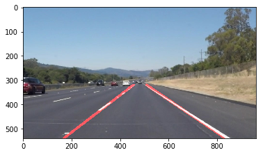

# **Finding Lane Lines on the Road** 

Overview
---

When we drive, we use our eyes to decide where to go.  The lines on the road that show us where the lanes are act as our constant reference for where to steer the vehicle.  Naturally, one of the first things we would like to do in developing a self-driving car is to automatically detect lane lines using an algorithm.

In this project you will detect lane lines in images using Python and OpenCV.  OpenCV means "Open-Source Computer Vision", which is a package that has many useful tools for analyzing images.  

To complete the project, two files will be submitted: a file containing project code and a file containing a brief write up explaining your solution. We have included template files to be used both for the [code](https://github.com/udacity/CarND-LaneLines-P1/blob/master/P1.ipynb) and the [writeup](https://github.com/udacity/CarND-LaneLines-P1/blob/master/writeup_template.md).The code file is called P1.ipynb and the writeup template is writeup_template.md 

To meet specifications in the project, take a look at the requirements in the [project rubric](https://review.udacity.com/#!/rubrics/322/view)

### Reflection

### 1. Describe your pipeline. As part of the description, explain how you modified the draw_lines() function.

first I would like to describe what i think about this project. When i take consideration of the computer vision technique that i've learned in the previous course i thought that I can first couvert the image to grayscale, process the image with canny function and don't need to select the white and yellow color in this image. but When i did that i realized that there are a lot of noise that I can't get rid of. so finally i add this step to my pipeline.

My pipeline consisted of 5 steps. First, I select the yellow and white color on the image so that the yellow and white lane lines appear on the image, then I converted the images to grayscale.

At the third part of the pipeline, I use the Gaussian filter with the 5x5 Kernel to smooth the image. Then I apply Canny function on the image and got the black background with several white lines. Finally I apply Hough function houghlineP() (Probabilistic Hough Line Transform), so that i can get several lines segment in a library image, and then i can draw the right and left lane lines on the road image with these segments.

In order to draw a single line on the left and right lanes, I modified the draw_lines() function by extract the right and left slope and intersection,average them, and add them to a list.

(''')
def line_select_extrapolate(lines):
    leftlines    = [] # (slope, intercept)
    leftlines_weights  = [] # (length,)
    rightlines   = [] # (slope, intercept)
    rightlines_weights = [] # (length,)
    
    for line in lines:
        for x1, y1, x2, y2 in line:
            if x2==x1:
                continue # ignore a vertical line
            slope = (y2-y1)/(x2-x1)
            intercept = y1 - slope*x1
            length = np.sqrt((y2-y1)**2+(x2-x1)**2)
            if slope < 0: # y is reversed in image
                leftlines.append((slope, intercept))
                leftlines_weights.append((length))
            else:
                rightlines.append((slope, intercept))
                rightlines_weights.append((length))
    
    # add more weight to longer lines    
    left_lane  = np.dot(leftlines_weights,  leftlines) /np.sum(leftlines_weights)  if len(leftlines_weights) >0 else None
    right_lane = np.dot(rightlines_weights, rightlines)/np.sum(rightlines_weights) if len(rightlines_weights)>0 else None
    
    return left_lane, right_lane # (slope, intercept), (slope, intercept)
(''')

### 2. Identify potential shortcomings with your current pipeline

One potential shortcoming would be what would happen when the curvature in the lane lines exist. In this case the detection of the lane lines would be difficult because the hough transform can only detect the straight lines.

Another shortcoming could be is that it won't work for steep (up or down) roads because the region of interest mask is assumed from the center of the image.

### 3. Suggest possible improvements to your pipeline

A possible improvement would be to use the hough circle transform and combine it with hough lines, so that we can detect the curvature better.

Another potential improvement could be to use some machine learning methods to learn specific shapes of lanes and then detect them. It could be necessary when the road is without any lane.

